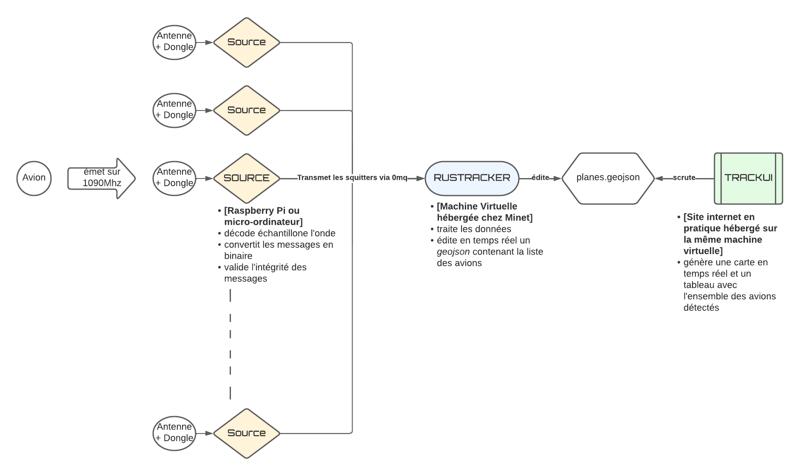

# Format

Notre projet est divisé en trois grandes parties :

1. La réception des messages : Source
2. Leur traitement : Rustracker
3. Leur affichage dans une interface graphique web : Trackui

 
L'intéraction entre ces trois parties est présentée dans le diagramme suivant qui facilitera la compréhension de l'architecture du projet que nous allons vous présenter. 

