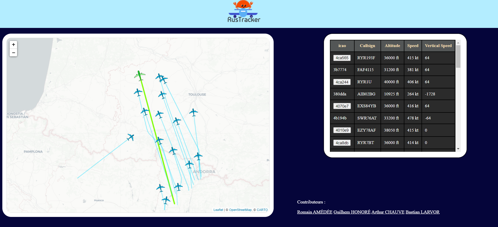

La version complète et fonctionnelle du projet peut être observée sur le lien suivant [RusTracker](http://rustracker.h.minet.net).
      

À gauche on trouve une carte où les avions sont affichés. Et à droite les vols avec toutes leurs informations sont listés dans un tableau.
