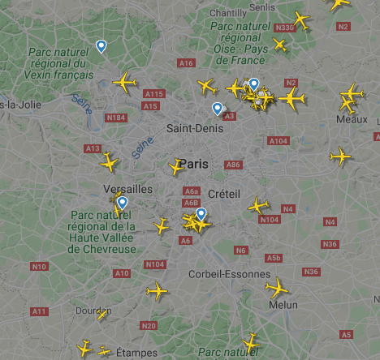

# Introduction

L’ADS-B (Automatic Dependent Surveillance-Broadcast) est un système de contrôle du
trafic aérien. Un avion utilisant l’ADS-B détermine sa position par un système de positionnement satellite et
la renvoit cette dernière (ainsi que d’autres informations sur le vol, altitude, vitesse, modèle de l’avion, etc)
dans toutes les directions aux autres appareils disposant de l’ADS-B. Ces messages sont détectables, puis
démodulables, par toute personne à l’aide d’une clef TNT (tuner RTL2832U, 15€), utilisée en SDR (Software Defined Radio),
qui permet de définir les paramètres de réception, comme par exemple la fréquence,
depuis l’ordinateur. L’objectif du projet est d’utiliser ces messages envoyés par les avions, et de proposer
une interface graphique à l’utilisateur. Sur cette interface, on souhaite observer en temps réel l’ensemble
des avions à portée de notre antenne ; nous souhaitons également pouvoir observer la trajectoire des avions
ainsi que connaître les informations sur le vol (altitude, vitesse, moteur, ...).

### Description du livrable minimal :  

* Intercepter, démoduler, interpréter des signaux ADS-B envoyés par plusieurs avions
* En extraire des informations sur la position, vitesse, modèle,...
* Utiliser ces données pour générer en temps réel une carte sur laquelle figurent les avions
* Possibilité d’obtenir les informations concernant le vol des avions sélectionnés
  
 

  

    <b> Exemple de carte recherchée (FlightRadar24) </b>

### Description brève :  
Ce projet est décomposée en trois parties communicantes les unes avec les autres : Source, Rustracker et TrackUI.

 <ul>
  <li> 
 <b>Source</b> : c'est le programme chargé d'intercepter les signaux ADS-B émis par les avions à 1090MHz. Il procède ensuite de les démoduler (réception sous forme de I&Qs), de les convertir en binaire et les envoit, grâce au protocole TCP, à Rustracker. 
</li>
  <li> 
 <b>Rustracker</b>: c'est le programme principal, stocké sur une machine virtuelle, qui récupère les signaux sous forme binaire émis par Source, les interprète afin d'en extraire les informations sur le vol des avions (position, vitesse, altitude, numéro de vol, etc). Il écrit toutes ces informations dans un fichier geojson qui sera lu par Trackui. 
 </li>
  <li>
 <b>Trackui</b>: il s'agit de l'interface graphique de notre travail, sous forme de page web, herbergée par un serveur nginx sur la machine virtuelle évoquée plus tôt. Elle consulte à intervalles de temps régulier le fichier geojson mis à disposition par Rustracker et affiche les avions en conséquences sur la carte, les autres données concernant les avions sont regroupées dans un tableau à côté de la carte.

</li>
</ul> 

