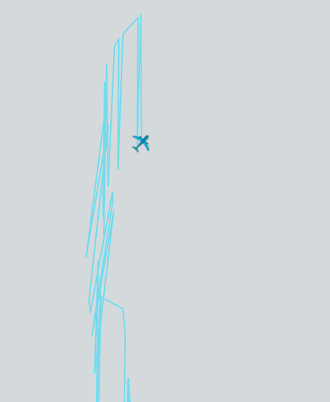

# Gestion des erreurs de positions :

L’algorithme de CPR présente un avantage certain. Toutefois, il peut comporter des erreurs. Celles-ci sont principalement dûes au décodage des index des zones de latitude et longitude, et à d’autres calculs sensibles. Principalement lors de la transition de l’avion entre deux zones distinctes.

Comme présenté par la NASA (cf. bibliographie), ces erreurs sont dûes à l’utilisations de nombres flottants. Leur code fournit des preuves en temps réel de leurs résultats grâce à l’ACSL.

Cependant, nous devons trouver un moyen de traiter ces erreurs lorsqu’elles surviennent. 

Plusieurs solutions sont suggérées dans l’ouvrage de Junzi Sun (cf. bibliographie), dont la cohérence de la position de l’avion en fonction de la portée de l’antenne. Cette solution n’est pas envisageable pour nous car les récepteurs communiquent de façon anonyme avec le serveur.

En observant les positions aberrantes que nous obtenions, on a remarqué une oscillation de la trajectoire. Nous avons donc imaginé une autre solution, qui est un test de cohérence. 

  

Comme présenté postérieurement, les messages de vitesses donnent une information : le « Track angle », qui est le cap suivi par l’avion (entre 0° et 360°). Or ce cap peut aussi être obtenu par une déduction à partir des deux dernières positions connues qui créent un vecteur dont la direction est égale au cap (bien que plus imprécis).

En comparant les deux résultats obtenus sur les toutes premières positions décodées de l’avion, nous pouvons détecter ces oscillations qui sont impossibles avec un cap constant et donc éliminer ces trajectoires problématiques. 

# Mise en pratique :

Cette comparaison de cap était initialement effectuée sur tous les points de la trajectoire, cependant le calcul est lourd et a entraîné un retard du serveur sur les messages reçus. Nous avons donc fait le choix de tester seulement les premières positions de l'avion.
