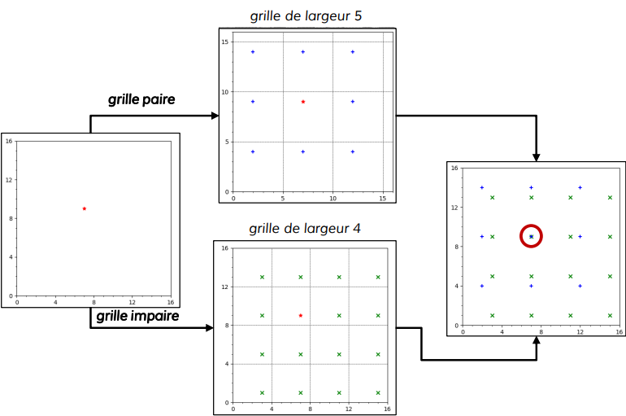

# Compact Position Reporting (CPR) :

La contrainte des 56 bits de données dans le cadre de la position peut être problématique pour un obtenir une précision suffisante. En effet, le rôle numéro 1 du contrôle aérien est d’assurer la sécurité des avions par une bonne séparation de ceux-ci. Or pour ce faire, il faut avoir l’altitude de l’avion, sa latitude, et sa longitude.

Pour le codage de la latitude/longitude, en pratique une précision suffisante (environs 5 mètres près) est atteinte en 45 bits, or seul 35 sont utilisés. Et cela grâce à l’algorithme de compact position reporting.

Cet algorithme repose sur le découpage du globe en zone longitudinale et latitudinal. On procède à deux découpages légèrement différents, ce qui donne deux grilles que l’on nomme pair et impaire. Ainsi, au lieu d’encoder la position sur un seul message, seule la position à l’intérieur d’une case d’une grille est codée. On transmet alors cette position « interne » à la grille sur un message qui indique la parité de la grille, puis en couplant les messages de positions pair et impair, nous parvenons à identifier la position réelle de l’avion.

Un exemple simple de l’idée qu’utilise l’algorithme CPR peut se faire à l’aide de surface « simple » de 16x16, on divise cette surface par une grille de 5x5, notre grille paire, et une grille de 4x4, notre grille impaire.

La position que l’on souhaite obtenir est de (x=7 ; y=9). Cette position se trouve aux coordonnées (x = 2 ; y=4) d’une case de la grille paire et dans (x= 3 ; y = 1) de la grille impaire. On retrouve la position en superposant toutes les possibilités des deux grilles, et en obtenant une unique correspondance entre les deux.

  

En pratique, l’algorithme CPR commence par décoder dans cet ordre l’index de la zone latitudinale, la latitude, puis l’index de la zone longitudinale puis la longitude. En effet, on cherche la position d’abords globale, c’est-à-dire identifier la « case » dans laquelle se situe l’avion.

Cette recherche qui s’effectue grâce à un message paire et impaire donne une position « globale ».

Ce premier décodage de position permet en effet de connaître la zone dans laquelle l’avion se situe. Puisque le déplacement de l’avion est continu, pour le décodage des positions suivantes, les indexes longitudinaux et latitudinaux peuvent être directement déduis de la position précédente. On utilisera alors qu’un seul message de parités quelconque.

Les messages de positions transmettent aussi l’altitude qui se décode sans algorithme particulièrement remarquable.

