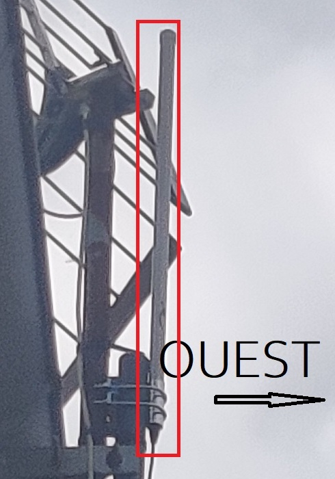
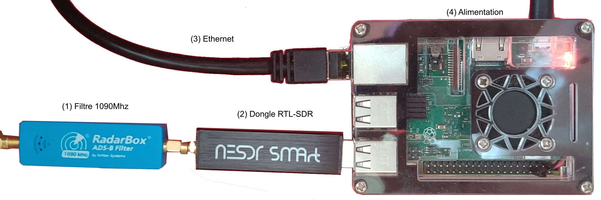
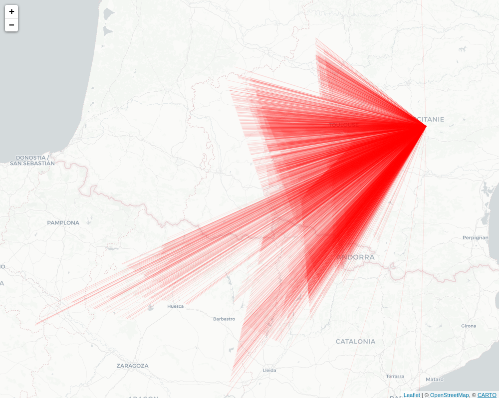

# Infrastructure

Comme présenté précédemment, l'architecture mise en place implique que le code de *SOURCE* soit installé sur une station, en l'occurence un raspberry, qui soit lui même connecté à une anntenne.

Nous l'avons mis en pratique, en installant une antenne spécialisé pour l'ADS-B sur le toit d'une maison située près de Castres dans le Tarn. Les conditions d'installation font qu'elle possède une meilleure réception vers l'Ouest (en théorie).

  

Cette antenne est alors connectée à un filtre 1090MHz (1), puis au dongle RTL-SDR (2) qui s'assure de l'échantillonage. La connexion éthernet permet de transmettre au serveur situé à Evry les messages binaires reçus.

  

# Performance de l'antenne

On observe une très bonne performance de l'antenne. Assurant une bonne réception dans les 300km au sud, voir 500km

  

