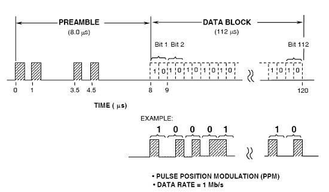

# Source

La réception des squitter se fait de façon indépendante de leur traitement dans un programme Rust nommé « Source ».

Le principe est d’installer ce programme sur une station (dans notre cas un raspberry pi) dont le but est de capter le signal et de le transmettre au serveur.

Le squitter est d’abord émis par l’avion omnidirectionnellement sur la fréquence de 1090MHz, il voyage alors à travers l’atmosphère avant d’être réceptionné par notre antenne. L’onde de 1090Mhz est alors échantillonnée à l’aide d'un Dongle DVB-T pourvu d’une puce <b>RTL2832U</b>. Initiallement destiné à la réception de la TNT (≈20€), l’utilisation de drivers différents permet de le convertir en système SDR (Software Define Radio), dont on peut choisir la fréquence de réception.

Nous avons fait le choix d’utiliser Soapy SDR (disponible en package pour Rust), qui permet à l’aide de simple lignes de code, de se connecter au dongle et de choisir le taux d’échantillonnage, la fréquence de réception et le gain. 

L’onde est modulée en quadrature (I&Q), le résultat est obtenu sous forme de complexe, que l’on démodule en calculant le module. À partir de là, on dispose de l’onde, toutefois il faut encore identifier les messages ADS-B situés dans l’échantillon. Ils sont échantillonnés à une fréquence : 

<code>
 fe = 2.106 Hz (soit Te = 500 ns)
 </code> 

 
Sachant qu’il faut deux amplitudes pour coder un bit, la durée totale d’un message est de 112 microsecondes. Pour identifier le début du squitter on s’appuie sur la détection du préambule. Il s’agit d’un motif caractéristique (cf. image). Il existe plusieurs moyens de détecter un préambule (cf. bibliographie), nous avons utilisé sa détection logique. Le but de cette méthode est d’identifier par des opérations logiques (<, >) les successions d’amplitudes sur l’onde s’apparentant au motif (cf. figure préambule).

  

Pour ce faire, on parcourt l’échantillon de l’onde, puis à partir de l’amplitude [i], on établi une moyenne des valeurs « hautes » ([i], [i+2], [i+7], [i+9]), puis on vérifie que toutes les autres valeurs jusqu’à [i+15] sont inférieures aux valeurs hautes et suivent les bonnes variations d’amplitudes. 

Dès que l’on identifie un préambule, on stocke les 224 points suivants de l’échantillon pour les convertir en binaire selon la méthode suivante :
Chaque paire de points successives et d’amplitudes (A1, A2) définit un unique bit b tel que si A1>A2 alors b = 1, sinon b=0.

Nous obtenons enfin les 112 bits.

Dès lors, nous sommes en mesure de vérifier l’intégrité du message à l’aide du CRC.

Ce dernier se représente sous la forme d’un polynôme :

<code>
𝑃(𝑥)= 𝑥24 + 𝑥23 + 𝑥22 + 𝑥21 + 𝑥20 + 𝑥19 + 𝑥18 + 𝑥17 + 𝑥16 + 𝑥15 + 𝑥14 + 𝑥13 + 𝑥12 + 𝑥10 + 𝑥3 + 1
</code>

Le message binaire est alors transmis au serveur à l’aide de la bibliothèque de messagerie asynchrone zero-mq.
