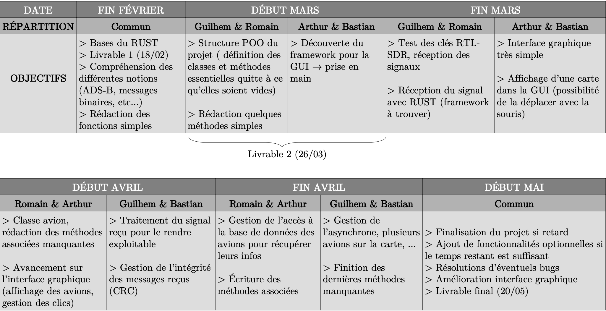

# Storyline

The original retro planning was:

But over the project difficulties forced us to change the devellopment organization.

#### Febuary
The team began to learn rust programming language and designed the original architecture after a couple meetings.

